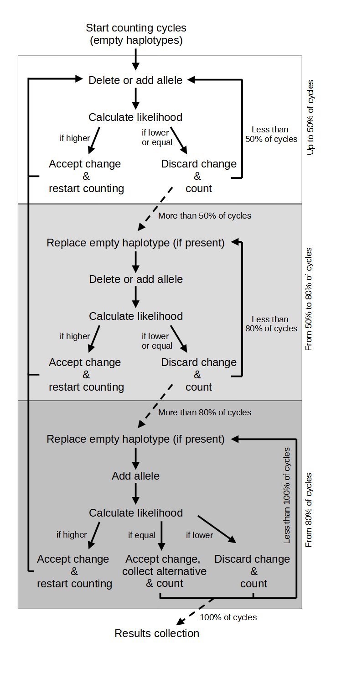

# Krempna- MHC paternal haplotype reconstruction

Reconstruction of paternal MHC haplotypes based on genotyped mothers and offspring. 

The analysis includes three main steps:
1. Plot families and recostruct plausible maternal MHC haplotypes
2. Reconstruct paternal haplotypes with maximum likelihood method. The scheme of the algorithm and equation is shown below.
3. Analysis of paternal haplotypes and the accuracy of the method

